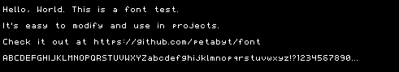

# 7x5 Font

A simple font for OS dev, embedded, etc.  

For a 3x3 font, check out https://github.com/petabyt/font3x3  

## Features:
- A-Z
- a-z
- 0-9
- 28 symbols
- No specification needed, it's dead simple
- C Preprocessor options
- Some [extended ASCII](https://theasciicode.com.ar/extended-ascii-code/block-graphic-character-ascii-code-219.html) characters

## Usage:
For easy modification, the font is stored in 7x5 character array.  
Simply loop through the array to find the char you need, then  
loop through the characters, (height = 7, width = 5). When you  
encounter a '#', plot. If space, don't plot.  

Compile demo.c for a simple terminal-based example.  
